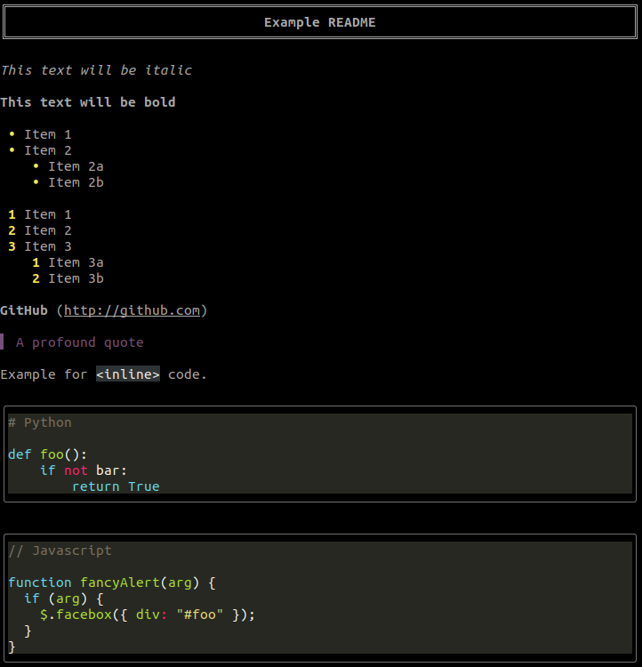

# mdo

Terminal markdown viewer.

Based on [github.com/willmcgugan/rich](https://github.com/willmcgugan/rich).

## Example

```
$ mdo examples/README.md
```



## Install

With [pipx](https://github.com/pipxproject/pipx)

```
$ pipx install mdo
```

With `pip`:

```
$ pip install mdo
```

## Usage

```
$ mdo FILE

# E.g: mdo README.md
```

### Help Output

```
$ mdo --help
```

```
Usage: mdo [FILE_PATH] [OPTIONS]

Options:
  -w, --width TEXT  Width of text. Default: 130. 'full' for full screen
  --no-pager        Print to terminal. Don't use a pager (e.g 'less')
  -h, --help        Show this message and exit.
```
